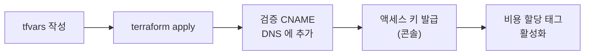

# bootstrap — 클러스터보다 오래 사는 것

`envs/stg` 는 하루 만들고 지우지만, 여기 있는 것은 지우지 않는다.

| 지우면 | 무엇을 잃나 |
|---|---|
| tfstate 버킷 | Terraform 이 자기가 만든 것을 잊는다 |
| 관측 버킷 | 판 결과 — 판과 판을 비교할 수 없다 |
| ECR | 이미지 — 켤 때마다 CI 부터 다시 돌려야 한다 |
| ACM 인증서 | 판마다 발급 · 검증 레코드를 다시 넣어야 한다 |

state 는 **로컬 파일**이다. 이 state 가 만드는 버킷을 backend 로 쓰면 만들기 전에 참조하는 순환이 된다. `.gitignore` 로 저장소에서 뺀다.

---

## 자원

| 자원 | 설정 | 이유 |
|---|---|---|
| tfstate 버킷 | 버전 관리 · SSE · 공개 차단 | state 가 깨졌을 때 되돌리는 유일한 수단. state 에 민감값이 들어간다 |
| 관측 버킷 ×3 (Mimir · Loki · Tempo) | 20일 만료 · 끊긴 멀티파트 3일 · SSE · 공개 차단 | 도구 보존이 15일이다. 같게 두면 도구가 아직 인덱스에 든 블록을 S3 가 먼저 지워 쿼리가 깨진다 |
| ALB 접근 로그 버킷 | 리전 ELB 서비스 계정에만 PutObject · SSE-S3 · 20일 | 쓰는 주체가 IAM 역할이 아니라 ELB 서비스 계정. KMS 면 ALB 가 못 써 로그가 조용히 안 쌓인다 |
| ECR ×3 (queue-go · booking · frontend) | MUTABLE · 푸시 시 스캔 · 최근 10개 | 같은 커밋에서 job 을 재시도할 때 push 가 막히지 않게. 나이로 지우면 판 사이가 벌어질 때 이미지가 사라진다. prd 면 IMMUTABLE |
| IAM 사용자 `ci-push` | ECR push + `BatchGetImage` | push 에도 읽기 하나가 필요하다 — docker 가 레이어를 올린 뒤 매니페스트를 HEAD 로 확인한다. 없으면 레이어는 다 올라가고 마지막에만 403 |
| IAM 사용자 `image-updater` | ECR 목록 · 이미지 설정 읽기 | 태그 이름이 아니라 빌드 시각(newest-build)으로 고르므로 설정 블록까지 읽는다 |
| ACM 인증서 | DNS 검증 · `create_before_destroy` | 검증 레코드가 남아 있는 동안 ACM 이 스스로 갱신한다 |
| 월 예산 경보 | 실제 50 · 80 · 100% + 예측 100% · 크레딧 제외 | 지우는 것을 잊었을 때 알아차리려고. 비용 데이터가 8–12시간 늦어 켜 둔 동안의 감시로는 못 쓴다 |

모든 자원에 `Project=cgv` · `Environment=shared` · `ManagedBy=terraform` 이 붙는다.

**액세스 키는 여기서 만들지 않는다.** 만들면 비밀값이 state 에 평문으로 남는다. 사용자만 만들고 키는 콘솔에서 발급한다.

**`aws_acm_certificate_validation` 을 두지 않는다.** 그 자원은 발급될 때까지 apply 를 붙들고, 발급을 기다려야 하는 다음 자원이 Terraform 안에 없다(443 리스너는 ALB Controller 가 만든다). 컨트롤러는 Ingress 의 host 와 이름이 맞는 발급된 인증서를 찾아 붙이므로 ARN 을 어디에도 안 적는다.

---

## 처음 한 번



1. `bootstrap/terraform.tfvars` 작성 (`.gitignore` 대상)

   ```hcl
   budget_email = "경보를 받을 주소"
   stg_hostname = "서비스 호스트 이름"
   ```

2. `terraform init && terraform apply`
3. 인증서 검증 레코드를 DNS 에 넣는다. Cloudflare 면 **프록시를 끄고 DNS only**.

   ```
   terraform output acm_validation_records
   aws acm describe-certificate --certificate-arn $(terraform output -raw acm_certificate_arn) --query Certificate.Status
   ```

4. 콘솔에서 IAM 사용자 둘의 액세스 키를 발급한다.

   | 사용자 | 넣는 곳 |
   |---|---|
   | `cgv-stg-ci-push` | GitLab CI 변수(마스킹) — `ECR_AWS_ACCESS_KEY_ID` · `ECR_AWS_SECRET_ACCESS_KEY` |
   | `cgv-stg-image-updater` | cgv-infra 의 image-updater 레지스트리 자격 봉인본 |

5. 비용 할당 태그를 활성화한다. 태그가 붙은 자원이 한 번은 있어야 키가 목록에 뜨고(하루까지), 활성화 뒤 보고서 반영에 하루가 더 걸린다 — **켜는 날보다 앞서** 한다.

   ```
   aws ce update-cost-allocation-tags-status \
     --cost-allocation-tags-status TagKey=Project,Status=Active TagKey=Environment,Status=Active
   ```

6. 계정 EC2 vCPU 한도(L-1216C47A)를 확인한다. 노드 일곱이 28 vCPU 이고 기본 한도는 32 다 → [modules/eks](../modules/eks/README.md#계정-vcpu-한도).

---

## 출력

| 출력 | 어디에 쓰나 |
|---|---|
| `tfstate_bucket` | `envs/stg/main.tf` 의 backend |
| `observability_buckets` | cgv-infra 관측 값 파일 |
| `ecr_repositories` | GitLab CI 의 push 대상 · cgv-infra ApplicationSet 의 registry |
| `ecr_users` | 액세스 키를 발급할 사용자 이름 |
| `acm_validation_records` · `acm_certificate_arn` | DNS 검증 · 발급 확인 |
| `alb_logs_bucket` | cgv-infra Ingress 의 `access_logs.s3.bucket` |

---

## state 를 잃었을 때

이름이 결정적(`<prefix>-<이름>-<계정ID>`)이라 `terraform import` 로 되살린다. 시도해 본 적은 없다.
